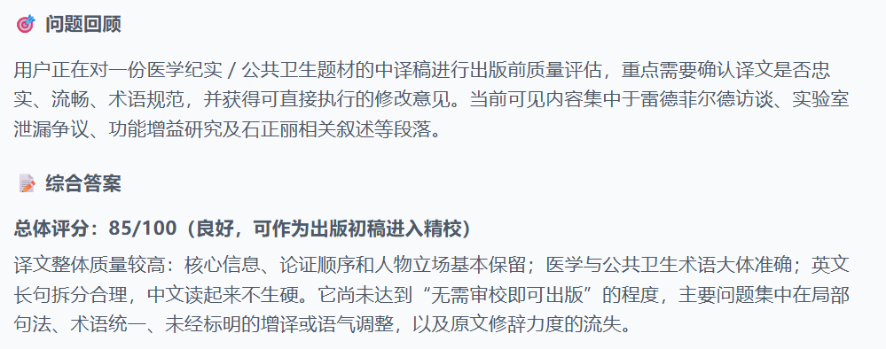
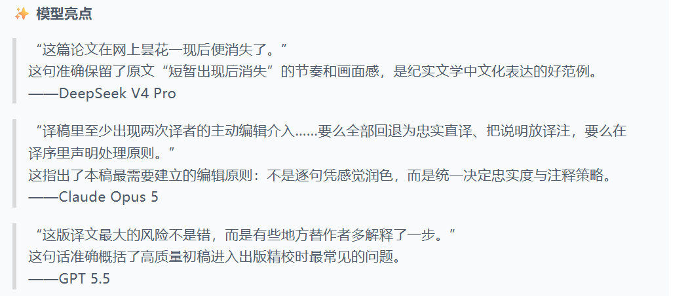
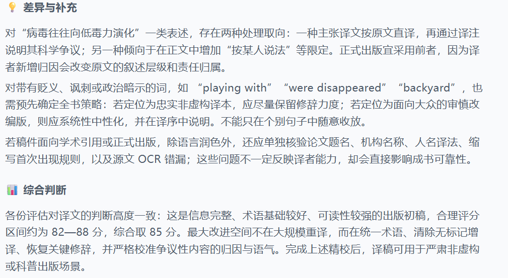

# Professional Translation Skill

一套可复用的专业翻译技能包，将出版级翻译的完整方法论沉淀为可执行流程：从译前任务界定、术语体系搭建，到译中语义与语气把控，再到译后四轮审校与项目管理规范，全部固化为可复用的工作流、检查清单和实战脚本。**经长篇出版物翻译实战验证**（98页扫描PDF → 约7万字全译本的完整交付）。

**适用场景**：长篇幅出版物、医学/法律/技术文档、合同与学术材料的专业翻译，以及任何需要术语一致、事实可核、决定可追溯的翻译任务。

**核心信条**：不猜测、不擅改、有依据、可复核。

> [!WARNING]
> **⚠️ 强制要求：所有翻译产出在交付或发布前，必须经过具备领域知识的人工逐字复核。**
> 本技能包及 AI 模型生成的一切内容（译文、术语表、审校意见）均为辅助草稿，**不能替代人工终审**。

---

## 为什么值得信赖

- **方法论完整闭环**：译前（边界确认/术语建库）→ 译中（语义逻辑/语气/事实把控）→ 译后（四轮审校）→ 项目管理（版本/日志/流水线）
- **实战验证**：本流程在真实长篇医学出版物翻译中跑通全链路，脚本均经实际运行测试
- **教训驱动**：核心规则全部来自实战中真实犯过的错误（增译、漏同步、丢格式、版本混乱等11类），每条规则都有对应的事故案例
- **可追溯**：每个翻译决策都要求记录依据（时间/位置/原因/来源页码）

### 实战项目概览







---

## 包含内容

```
professional-translation/
├── SKILL.md                          # 触发说明 + 核心规则 + 四阶段工作流
├── scripts/                          # 可执行脚本（已测试）
│   ├── assess_scanned_pdf.py         #   OCR 前质量评估（判型/DPI/清晰度/水印/语言）
│   ├── docx_replace_text.py          #   docx 文本替换，保留 run 格式
│   ├── normalize_dates.py            #   日期规范化（中文数字→阿拉伯，保护专名）
│   └── make_version_readme.py        #   版本清单 + 修改日志生成器
├── references/                       # 参考文档（按需加载）
│   ├── source-extraction.md          #   扫描PDF → 文字层 OCR 流水线
│   ├── scanned-pdf-pipeline.md       #   OCR管线全流程 + 水印A/B实验 + 准确率预期
│   ├── task-boundary.md              #   译前边界确认清单
│   ├── review-checklists.md          #   四轮审校清单
│   └── project-lessons.md            #   实战教训（11条错误→规则）
└── assets/                           # 模板资源
    ├── glossary_template.json        #   术语表模板
    └── style_guide_template.md       #   风格指南模板
```

---

## v3.0 升级：扫描 PDF OCR 管线 + 逐阶段 QA 复核

v3.0 将「扫描版 PDF 高准确率提取管线」融入本技能包，并引入**逐阶段复核关卡（QA Gate）**：每个阶段执行完毕后必须复核，**通过才进入下一步，不达标则带问题清单打回重做**。适用于医学/法律/学术等严谨文档的「扫描 PDF → 专业译稿」端到端场景。

### 新增能力

| 能力 | 说明 |
|---|---|
| **PDF 判型** | 全页遍历检测文本层：有文字层 → 直接提取（准确率 ≈100%，无需 OCR）；无 → 走 OCR 管线 |
| **OCR 前质量评估** | 提取原始嵌入图（非低倍渲染）、DPI（≥300 优）、清晰度（Laplacian 方差 >500）、水印检测、语言探针——**先给用户准确率预期，再全量 OCR** |
| **水印检测与处理（实测修正）** | 斜向浅灰水印用 Hough 直线 + 灰度采样检测（OCR 文本检测不到旋转水印）。**修正原「去水印」步骤：浅色水印（≤30% 透明度）不要 inpaint 去水印**——A/B 实测 inpaint 后 OCR 反而更差（`deluge`→`delur`、`World War II`→`Worlc var Il`）；直接带水印 OCR + LLM 纠错。仅深色覆盖型重水印才去，且须先 A/B 验证 |
| **全量 OCR + 双引擎交叉验证** | RapidOCR 逐页识别（约 4 秒/页 CPU），5–10% 随机页用第二引擎（PaddleOCR/Tesseract）对比，**差异处逐个解决**；低置信度块（<0.9）全部列出 |
| **带文字层 PDF 比对基准** | OCR 结果合并输出为带文字层 PDF，作为全程复核比对基准（OCR 会丢词漏句，复核必须回查） |
| **逐阶段 QA 复核（QA Gate）** | 每阶段有明确通过标准与打回机制；复核产物留痕（每阶段出复核报告），全程可追溯 |
| **数字零容忍** | 剂量/年份/百分比/日期/条款号 100% 核对——医学文档错一个数字即事故 |
| **LLM 纠错** | 修复三类典型 OCR 错误：粘连单词（`knowssomeone`→`knows someone`）、大小写（`CoviD`→`COVID`）、水印污染字符（`Worlc`→`World`） |
| **准确率实测数据** | 英文印刷体 342 DPI 扫描件：RapidOCR 平均置信度 98.4–98.5%（119 块 0 块 <0.9）；浅水印损失 ~0.5–1 点；LLM 纠错后 ~99%+；商业 OCR（ABBYY/Azure/Google）同类 99.5–99.8% |

### 端到端流程（执行 → 🛂复核 → 通过才进下一步）

```
Phase 0 任务边界确认 🛂 → Phase 1 源提取(质量评估+OCR+双引擎验证) 🛂
→ Phase 2 译前准备(术语表+风格指南) 🛂 → Phase 3 翻译 🛂
→ Phase 4 四轮复核(双语→术语事实→单语→格式) 🛂 → Phase 5 交付(七项验收+人工终检)
```

- 每道 🛂 = 复核关卡：不通过 → 带问题清单打回上一阶段重做，不向下游流
- 核心原则：**不猜测、不擅改、有依据、可复核**；主文件唯一真源；**最终验收权在用户**（交付前抽 3–5 页人工终检）
- 完整细节见 `SKILL.md`、`references/scanned-pdf-pipeline.md`（含水印 A/B 实验记录）与 `scripts/assess_scanned_pdf.py`

---

## 四阶段工作流

### 阶段一 · 译前：定义边界 + 建库
- **任务边界确认**（动笔前必答）：
  - 文本类型与用途（合同/法规/医学/技术/学术/营销——尺度不同）
  - 目标读者（专家/管理者/公众）、语言变体（简繁/英美）
  - 客户交付规范（术语偏好/格式模板/是否允许译注/是否保留修订记录）
  - 通读全文，理解主题、论点、指代、条件限制、文体语域
- **术语表**（活文档）：原文术语/标准译法/适用语境/禁用译法/来源/确认人，高风险信息查证权威来源
- **风格指南**：统一标题层级/大小写/标点/数字/单位/日期/缩写/人称

### 阶段二 · 译中：保信息逻辑，再优化表达
- 以**意义单元 + 逻辑关系**为单位，不逐词对译
- **语气强度零容错**：

  | 原文 | 不可译成 |
  |---|---|
  | may / might | 确定、必然 |
  | should | 必须、要求 |
  | likely / typically | 绝对结论、无条件规律 |
  | 相关 | 因果 |

- **事实零误差**：数字/小数点/百分比/货币/单位/日期/条款号/文献出处/人名机构——不可变
- **表达可适配**：语气、修辞、句式在忠实前提下按目标语习惯调整
- **原文有疑不擅改**：歧义/指代不明/逻辑矛盾 → 先查证 → 无法确定则保守处理 + 问题单
- **红线**：编辑意见/AI意见 = 待核对提议，不是事实；一切改动先对照原文

### 阶段三 · 译后：四轮审校（译完不即交）
1. **双语对照**：漏译/误译/多译/逻辑偏移/术语不一致/语气变化/无依据增译
2. **术语与事实专项**：数字、单位、日期、专名、法规编号、缩写、交叉引用
3. **单语通读**：只读译文——自然、清晰、无歧义、符合专业写作习惯
4. **格式与交付**：版式、标点、全半角、标题层级、版本号、模板要求

> 高风险文本（法律/医学/金融/监管/公开发表）→ 领域第二审校人或隔夜再审。

### 阶段四 · 项目管理
- 主文件唯一基准；格式版一律从主文件重新生成
- 版本清单（每个文件=什么+状态）+ 修改日志（时间/位置/原因/依据页码）
- 规范化脚本接入主流水线，目标=主文件，改后立即验证

---

## 七项成稿标准

| 标准 | 含义 |
|---|---|
| **准确** | 信息、逻辑、条件、范围、语气没有被曲解 |
| **完整** | 无漏译、无无依据的增译 |
| **一致** | 术语、称谓、格式、数字表达前后一致 |
| **专业** | 符合该领域通行译法和文体规范 |
| **自然** | 像目标语言的专业原生文本，而非逐字翻译 |
| **可追溯** | 关键译法、术语和存疑事项都有可靠依据或沟通记录 |
| **合规** | 满足委托方、发布平台、行业或监管机构的格式与质量要求 |

---

## 核心规则（实战教训沉淀）

| # | 规则 | 对应教训 |
|---|---|---|
| 1 | 主文件唯一基准：内容修改只改主文件，格式版从主文件重新生成 | 先改副本再改主文件 |
| 2 | 编辑意见/AI意见 = 待核对提议，不是事实 | 增译"在公寓内" |
| 3 | 术语表是活文档：正文改术语必须同步表 | 术语表不同步 |
| 4 | 规范化脚本接入主流水线，目标=主文件 | 日期规范化漏主文件 |
| 5 | 版本清单 + 修改日志 | 用户问"终极版是哪个" |
| 6 | 文本替换逐 run 保留格式 | set_text 丢格式 |
| 7 | 需求冲突先问优先级 | 页数 vs 字号过度工程 |
| 8 | 不可验证指标不假装精确 | 页数模拟自嗨 |
| 9 | 每阶段主动复盘，不等被追问 | 第一轮复盘遗漏 |
| 10 | 编辑文件后立即运行验证 | edit 误删函数体 |

---

## 工具边界

- **CAT/术语库/QA 功能**：适合处理一致性、重复内容、数字错位、漏译、标签缺失、格式错误
- **机器翻译**：辅助理解或生成初稿
- **最终定稿必须人工核实**：专业含义、逻辑边界、语用效果、事实依据，不把判断外包给工具

---

## 安装

将 `professional-translation/` 目录放入 OpenClaw 的 skills 目录即可被识别；或直接使用打包文件 `professional-translation.skill`。

## 脚本用法

```bash
# OCR 前质量评估（判型/DPI/清晰度/水印/语言探针，先给准确率预期再全量OCR）
python3 scripts/assess_scanned_pdf.py <file.pdf> --pages 1,34,67

# docx 文本替换（保留格式）
python3 scripts/docx_replace_text.py <file.docx> <old_text> <new_text> [--all]

# 日期规范化（中文数字年月日 → 阿拉伯；世纪 → 中文；保护《失落的二月》类专名）
python3 scripts/normalize_dates.py <input.docx> [output.docx]

# 版本清单 + 修改日志生成
python3 scripts/make_version_readme.py <project_dir> [--md-backup <backup.md>]
```

## 免责声明

本技能包及其配套脚本、模板和方法论，用于辅助和规范翻译工作流，但**不保证译文达到出版级质量**。

> **⚠️ 最重要的一条：无论翻译、润色、审校由谁（人或 AI）完成，最终定稿前必须由具备领域知识的人类专家逐字复核。** 这是不可省略的最终环节——AI 辅助可以提升效率与一致性，但**不能替代人工终审**；未经人工复核的译文不得用于正式出版、法律、医疗、金融、监管等场景。

翻译质量受以下因素影响，使用者应知悉并自行判断：

1. **模型能力与差异**：本工作流依赖大语言模型（LLM）执行翻译与审校，不同模型在术语理解、语境把握、语气还原上存在差异，同一文本在不同模型或不同版本下可能产生不同结果；模型输出可能存在事实性错误、逻辑偏差或表达失当。
2. **OCR 与源文本噪声**：当源文档为扫描件、照片或低质量 PDF 时，需经 OCR 提取文本。OCR 可能产生漏字、错字、断行、符号混淆（如 `1/l/|`、`0/O`）等错误，即使经过校对，仍无法完全排除识别误差对译文的影响。
3. **术语与专名风险**：人名、地名、机构名、法律条款、医学名词等高风险信息，自动提取和翻译可能存在不一致或错误，**务必对照权威来源人工复核**。
4. **AI 生成内容的核查义务**：本技能包产出的全部译文、术语表和审校意见，均属于**辅助草稿**，不构成最终交付物。用于正式出版、法律、医疗、金融、监管等场景前，必须由具备领域知识的专业人士进行逐字审校。
5. **无质量担保**：作者不对使用本技能包产生的任何直接或间接损失负责，不对译文的准确性、完整性、适销性作任何明示或默示担保。

**使用本技能包即视为已知悉并接受以上条款。**

---

## License

MIT
